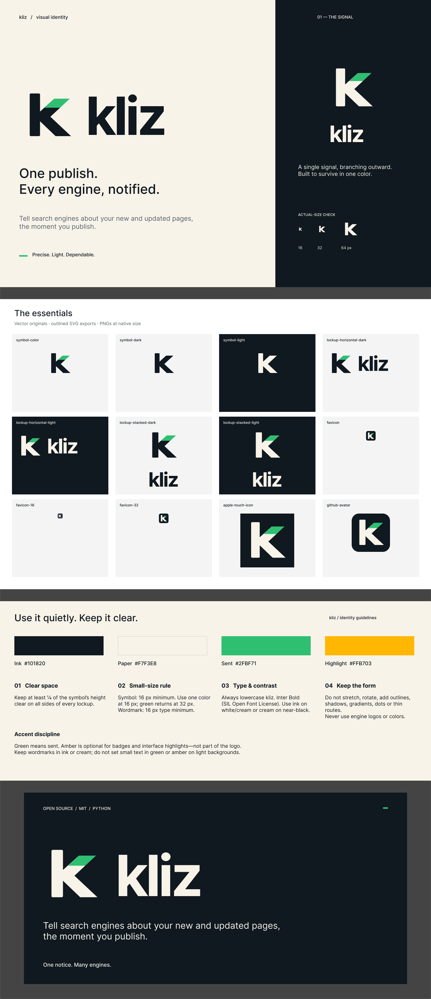

# kliz brand

**The signal:** a single signal, branching outward. The green stroke on the `k` is the notice
leaving your site; the mark is built to survive in one color.

## Files

All SVGs are outlined (no fonts needed), have transparent backgrounds and use only the
palette below. "Dark" files are ink artwork for light backgrounds; "light" files are cream
artwork for dark backgrounds.

| File | Use it for |
| :--- | :--- |
| [`symbol-color.svg`](symbol-color.svg) | The mark on light backgrounds |
| [`symbol-color-light.svg`](symbol-color-light.svg) | The mark on dark backgrounds |
| [`symbol-dark.svg`](symbol-dark.svg), [`symbol-light.svg`](symbol-light.svg) | One-color versions (print, embossing, monochrome UI) |
| [`lockup-horizontal-dark.svg`](lockup-horizontal-dark.svg), [`lockup-horizontal-light.svg`](lockup-horizontal-light.svg) | Headers, README, website top bar |
| [`lockup-stacked-dark.svg`](lockup-stacked-dark.svg), [`lockup-stacked-light.svg`](lockup-stacked-light.svg) | Square spaces: slides, stickers, social posts |
| [`github-avatar.svg`](github-avatar.svg), [`github-avatar.png`](github-avatar.png) (512 px) | Avatars and app-style icons |
| [`social-preview.png`](social-preview.png) (1280 × 640) | GitHub social preview, link cards |
| [`../assets/favicon.svg`](../assets/favicon.svg), `favicon-32.png`, `favicon-16.png` | Browser tabs |
| [`../assets/apple-touch-icon.png`](../assets/apple-touch-icon.png) (180 px) | iOS home screen |

`lockup-stacked-light.svg` and `symbol-color-light.svg` are derived from their dark
counterparts by swapping ink for paper, as the guidelines prescribe.

## Palette

| Name | Hex | Role |
| :--- | :--- | :--- |
| Ink | `#101820` | The mark and wordmark on light backgrounds; dark surfaces |
| Paper | `#F7F3E8` | Light surfaces; the mark and wordmark on dark backgrounds |
| Sent | `#2FBF71` | The signal stroke. Green means sent |
| Highlight | `#FFB703` | Optional, for badges and interface highlights. Not part of the logo |

## Use it quietly. Keep it clear.

1. **Clear space.** Keep at least ¼ of the symbol's height clear on all sides of every
   lockup.
2. **Small-size rule.** Symbol: 16 px minimum. Use one color at 16 px; the green returns at
   32 px. Wordmark: 16 px type minimum.
3. **Type and contrast.** Always lowercase "kliz", set in Inter Bold (SIL Open Font
   License). Use ink on white or cream, or cream on near-black.
4. **Keep the form.** Do not stretch, rotate, add outlines, shadows, gradients, dots or thin
   routes. Never use search-engine logos or colors.

**Accent discipline.** Green means sent. Amber is optional for badges and interface
highlights, not part of the logo. Keep wordmarks in ink or cream; do not set small text in
green or amber on light backgrounds.

## Voice

- Headline: **One publish. Every engine, notified.**
- Tagline: *Tell search engines about your new and updated pages, the moment you publish.*
- Short line: *One notice. Many engines.*
- Values: *Precise. Light. Dependable.*
